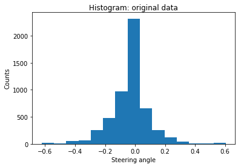
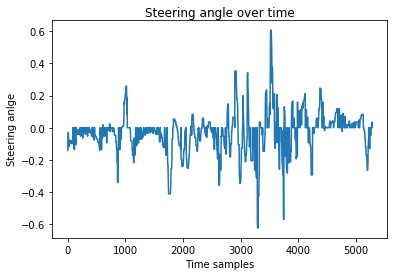
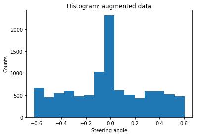
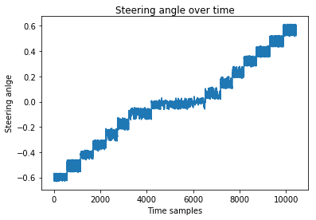

# Self-Driving Car Engineer Nanodegree

---

# Deep Learning Project: Behavioral Cloning

Design, train and validate a model for predicting steering angles from image data

---

## Overview

The steps of the project are the following:

* Data acquisition
* Data exploration
* Data augmentation
* Adaption of the CNN architecture from the NVIDIA paper [End to End Learning for Self-Driving Cars](http://images.nvidia.com/content/tegra/automotive/images/2016/solutions/pdf/end-to-end-dl-using-px.pdf)
* Model training
* Test of the trained model with the [Udacity simulator](https://github.com/udacity/self-driving-car-sim)
* Video recording of the vehicle driving one full lap autonomously

---

## Model architecture

Since the NVIDIA model from the [End to End Learning for Self-Driving Cars](http://images.nvidia.com/content/tegra/automotive/images/2016/solutions/pdf/end-to-end-dl-using-px.pdf) paper was designed exactly for this purpose, I adapted the model for this project. 

The model is basically a convolutional neural network (CNN) with five convolutional layers and three fully connected layers and is shown below. 

* Normalization and Cropping: After normalizing the input images in the first layer, the top of each image is cropped in the second layer since the upper part mostly shows sky and trees and does not contain any useful features for steering the vehicle.
* Gaussian noise: The next layer adds gaussian noise to the images to avoid using identical flipped images for training.
* Convolutional layers: Next, five convolutional layers are added. Like the NVIDIA model, the first three layers use a 5x5 Kernel with 2x2 stride followed by two layers with 3x3 Kernel and 1x1 stride.
* Flatten and Dense layers: After flattening the 2D images, the model consists of three fully connected layers with a dropout layer for each to avoid overfitting.

Since it is a regression network which is supposed to output a continuous steering angle, the last layer consists of a single node without an activation function. For minimizing the error between the predicted steering angles and the ground truth steering angles, mean squared error (mse) is used as loss function.

    Model: "sequential_2"
    _________________________________________________________________
    Layer (type)                 Output Shape              Param #   
    =================================================================
    lambda_2 (Lambda)            (None, 160, 320, 3)       0         
    _________________________________________________________________
    max_pooling2d_2 (MaxPooling2 (None, 80, 160, 3)        0         
    _________________________________________________________________
    gaussian_noise_2 (GaussianNo (None, 80, 160, 3)        0         
    _________________________________________________________________
    conv2d_6 (Conv2D)            (None, 38, 78, 24)        1824      
    _________________________________________________________________
    conv2d_7 (Conv2D)            (None, 17, 37, 36)        21636     
    _________________________________________________________________
    conv2d_8 (Conv2D)            (None, 7, 17, 48)         43248     
    _________________________________________________________________
    conv2d_9 (Conv2D)            (None, 5, 15, 64)         27712     
    _________________________________________________________________
    conv2d_10 (Conv2D)           (None, 3, 13, 64)         36928     
    _________________________________________________________________
    flatten_2 (Flatten)          (None, 2496)              0         
    _________________________________________________________________
    dense_5 (Dense)              (None, 100)               249700    
    _________________________________________________________________
    dropout_4 (Dropout)          (None, 100)               0         
    _________________________________________________________________
    dense_6 (Dense)              (None, 50)                5050      
    _________________________________________________________________
    dropout_5 (Dropout)          (None, 50)                0         
    _________________________________________________________________
    dense_7 (Dense)              (None, 10)                510       
    _________________________________________________________________
    dropout_6 (Dropout)          (None, 10)                0         
    _________________________________________________________________
    dense_8 (Dense)              (None, 1)                 11        
    =================================================================
    Total params: 386,619
    Trainable params: 386,619
    Non-trainable params: 0
    _________________________________________________________________

## Model training

A generator was used to avoid loading all images into memory at once. Training was done using ADAM optimizer which works with includes an adaptive learning rate.

The dataset basically consists of one round of driving in the middle of the road as precisely as possible and one recovery round, where the recording was started at the side of the road and steered back to the center. Additionally, the two curves with high curvature were driven again.
The images of all three cameras are used with an offset angle of 0.25 for the left image and -0.25 for the right image. Furthermore, a flipped version of each image was included to the dataset.

### Data exploration

#### Example image

Example images are provided below for different steering angles and all three camera positions.

#### Histogram and angle over time

