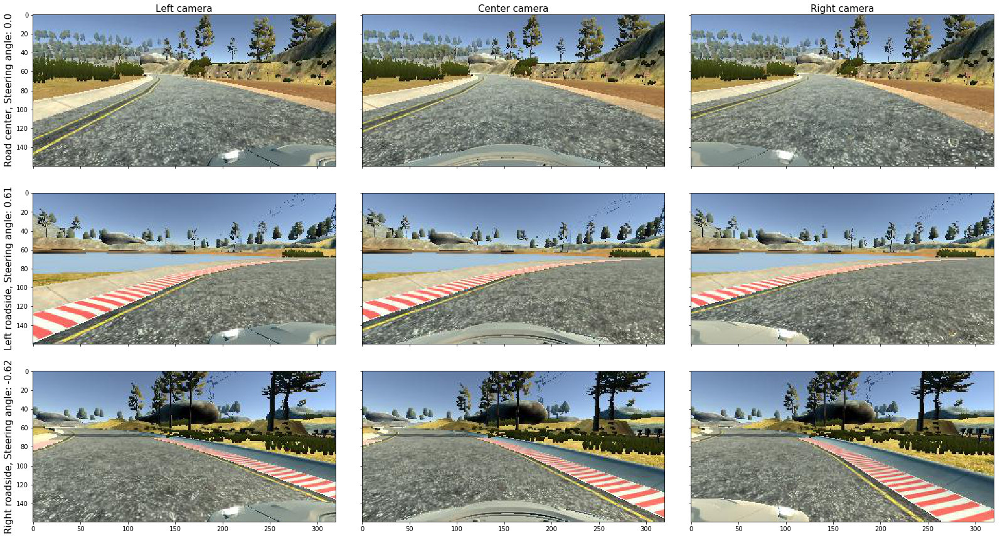
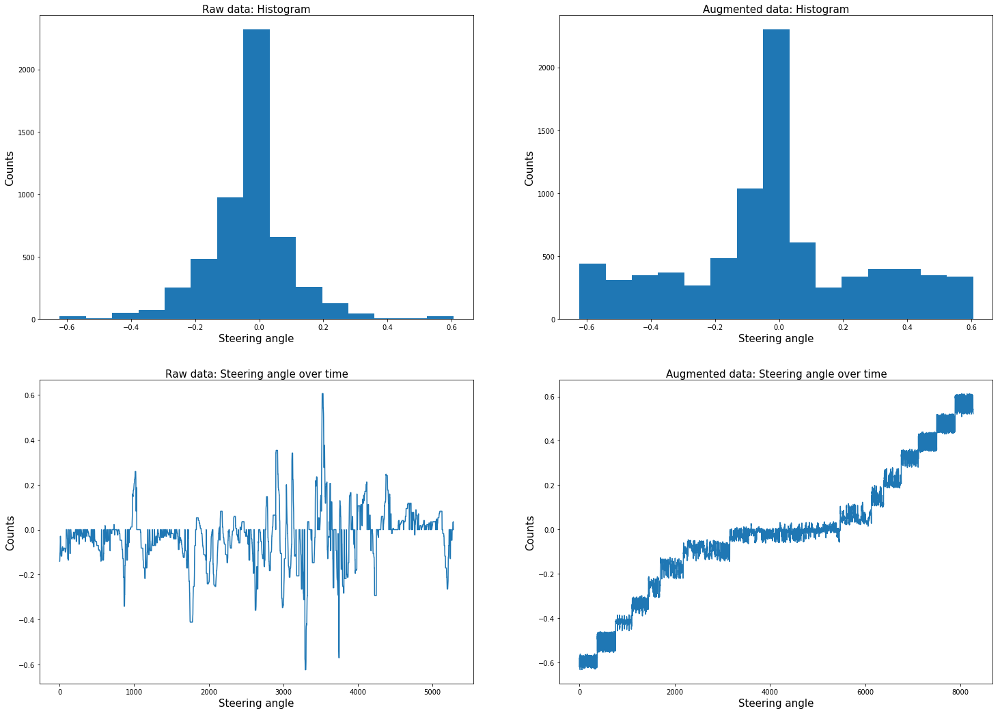
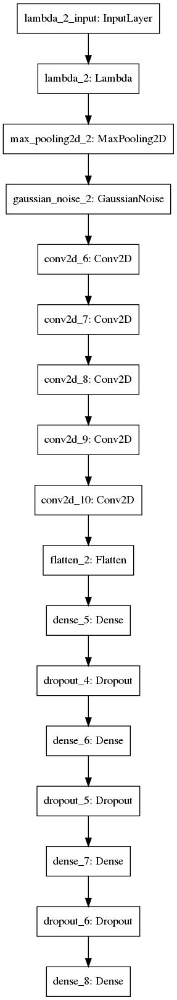

```python
import warnings
warnings.filterwarnings("ignore")

from model import *
from keras.utils import plot_model
```

    Using TensorFlow backend.


### Load .csv file, print head and tail of the used columns


```python
df = read_csv()
```


```python
df.head()
```


<div>
<style scoped>
    .dataframe tbody tr th:only-of-type {
        vertical-align: middle;
    }

    .dataframe tbody tr th {
        vertical-align: top;
    }

    .dataframe thead th {
        text-align: right;
    }
</style>
<table border="1" class="dataframe">
  <thead>
    <tr style="text-align: right;">
      <th></th>
      <th>center</th>
      <th>left</th>
      <th>right</th>
      <th>steering</th>
    </tr>
  </thead>
  <tbody>
    <tr>
      <th>0</th>
      <td>IMG/center_2019_09_14_10_46_34_907.jpg</td>
      <td>IMG/left_2019_09_14_10_46_34_907.jpg</td>
      <td>IMG/right_2019_09_14_10_46_34_907.jpg</td>
      <td>-0.141177</td>
    </tr>
    <tr>
      <th>1</th>
      <td>IMG/center_2019_09_14_10_46_34_973.jpg</td>
      <td>IMG/left_2019_09_14_10_46_34_973.jpg</td>
      <td>IMG/right_2019_09_14_10_46_34_973.jpg</td>
      <td>-0.141177</td>
    </tr>
    <tr>
      <th>2</th>
      <td>IMG/center_2019_09_14_10_46_35_053.jpg</td>
      <td>IMG/left_2019_09_14_10_46_35_053.jpg</td>
      <td>IMG/right_2019_09_14_10_46_35_053.jpg</td>
      <td>-0.141177</td>
    </tr>
    <tr>
      <th>3</th>
      <td>IMG/center_2019_09_14_10_46_35_132.jpg</td>
      <td>IMG/left_2019_09_14_10_46_35_132.jpg</td>
      <td>IMG/right_2019_09_14_10_46_35_132.jpg</td>
      <td>-0.123529</td>
    </tr>
    <tr>
      <th>4</th>
      <td>IMG/center_2019_09_14_10_46_35_203.jpg</td>
      <td>IMG/left_2019_09_14_10_46_35_203.jpg</td>
      <td>IMG/right_2019_09_14_10_46_35_203.jpg</td>
      <td>-0.123529</td>
    </tr>
  </tbody>
</table>
</div>


```python
df.tail()
```


<div>
<style scoped>
    .dataframe tbody tr th:only-of-type {
        vertical-align: middle;
    }

    .dataframe tbody tr th {
        vertical-align: top;
    }

    .dataframe thead th {
        text-align: right;
    }
</style>
<table border="1" class="dataframe">
  <thead>
    <tr style="text-align: right;">
      <th></th>
      <th>center</th>
      <th>left</th>
      <th>right</th>
      <th>steering</th>
    </tr>
  </thead>
  <tbody>
    <tr>
      <th>5278</th>
      <td>IMG/center_2019_09_14_11_48_10_152.jpg</td>
      <td>IMG/left_2019_09_14_11_48_10_152.jpg</td>
      <td>IMG/right_2019_09_14_11_48_10_152.jpg</td>
      <td>0.029412</td>
    </tr>
    <tr>
      <th>5279</th>
      <td>IMG/center_2019_09_14_11_48_10_237.jpg</td>
      <td>IMG/left_2019_09_14_11_48_10_237.jpg</td>
      <td>IMG/right_2019_09_14_11_48_10_237.jpg</td>
      <td>0.035294</td>
    </tr>
    <tr>
      <th>5280</th>
      <td>IMG/center_2019_09_14_11_48_10_321.jpg</td>
      <td>IMG/left_2019_09_14_11_48_10_321.jpg</td>
      <td>IMG/right_2019_09_14_11_48_10_321.jpg</td>
      <td>0.035294</td>
    </tr>
    <tr>
      <th>5281</th>
      <td>IMG/center_2019_09_14_11_48_10_403.jpg</td>
      <td>IMG/left_2019_09_14_11_48_10_403.jpg</td>
      <td>IMG/right_2019_09_14_11_48_10_403.jpg</td>
      <td>0.000000</td>
    </tr>
    <tr>
      <th>5282</th>
      <td>IMG/center_2019_09_14_11_48_10_591.jpg</td>
      <td>IMG/left_2019_09_14_11_48_10_591.jpg</td>
      <td>IMG/right_2019_09_14_11_48_10_591.jpg</td>
      <td>0.000000</td>
    </tr>
  </tbody>
</table>
</div>


### Load and plot example images


```python
fig, axs = plt.subplots(3, 3, figsize=(22,12))
plt.tight_layout()

idx_roadside_middle = df.steering.index[df.steering==0][0]
idx_roadside_left = df.steering.idxmax()
idx_roadside_right = df.steering.idxmin()

fontsize = 15

axs[0, 0].imshow(plt.imread(path+df['left'][idx_roadside_middle]))
axs[0, 0].set_title('Left camera', fontsize=fontsize)
axs[0, 0].set_ylabel('Road center, Steering angle: {}'.format(df.steering.iloc[idx_roadside_middle]), fontsize=fontsize)

axs[0, 1].imshow(plt.imread(path+df['center'][idx_roadside_middle]))
axs[0, 1].set_title('Center camera', fontsize=fontsize)

axs[0, 2].imshow(plt.imread(path+df['right'][idx_roadside_middle]))
axs[0, 2].set_title('Right camera', fontsize=fontsize)

axs[1, 0].imshow(plt.imread(path+df['left'][idx_roadside_left]))
axs[1, 0].set_ylabel('Left roadside, Steering angle: {0:.2}'.format(df.steering.iloc[idx_roadside_left]), fontsize=fontsize)

axs[1, 1].imshow(plt.imread(path+df['center'][idx_roadside_left]))

axs[1, 2].imshow(plt.imread(path+df['right'][idx_roadside_left]))

axs[2, 0].imshow(plt.imread(path+df['left'][idx_roadside_right]))
axs[2, 0].set_ylabel('Right roadside, Steering angle: {0:.2}'.format(df.steering.iloc[idx_roadside_right]), fontsize=fontsize)

axs[2, 1].imshow(plt.imread(path+df['center'][idx_roadside_right]))

axs[2, 2].imshow(plt.imread(path+df['right'][idx_roadside_right]))

# Hide x labels and tick labels for top plots and y ticks for right plots.
for ax in axs.flat:
    ax.label_outer()
```





### Plot histogram and angle over time of original data


```python
df = read_csv()

# print('Size of original data set: ', len(df))

# (counts, bins, _) = plt.hist(df.steering, bins=n_bins)
# plt.title('Histogram: original data')
# plt.xlabel('Steering angle')
# plt.ylabel('Counts')
# plt.show()

# plt.plot(df.steering)
# plt.title('Steering angle over time')
# plt.xlabel('Time samples')
# plt.ylabel('Steering anlge')
# plt.show()

```

### Plot histogram and angle over time of augmented data


```python
# df_aug = augment_data(df)

# print('Size of augmented data set: ', len(df_aug))

# plt.hist(df_aug.steering, bins=bins)
# plt.title('Histogram: augmented data')
# plt.xlabel('Steering angle')
# plt.ylabel('Counts')
# plt.show()

# plt.plot(df_aug.steering)
# plt.title('Steering angle over time')
# plt.xlabel('Time samples')
# plt.ylabel('Steering anlge')
# plt.show()
```


```python
df_aug = augment_data(df)
print('Size of raw data set: ', len(df))
print('Size of augmented data set: ', len(df_aug))


fig, axs = plt.subplots(2, 2, figsize=(25,18))
# plt.tight_layout()

fontsize2 = 15

(counts, bins, _) = axs[0,0].hist(df.steering, bins=n_bins)
axs[0,0].set_title('Raw data: Histogram', fontsize=fontsize2)
axs[0,0].set_xlabel('Steering angle', fontsize=fontsize2)
axs[0,0].set_ylabel('Counts', fontsize=fontsize2)

axs[1,0].plot(df.steering)
axs[1,0].set_title('Raw data: Steering angle over time', fontsize=fontsize2)
axs[1,0].set_xlabel('Steering angle', fontsize=fontsize2)
axs[1,0].set_ylabel('Counts', fontsize=fontsize2)

axs[0,1].hist(df_aug.steering, bins=bins)
axs[0,1].set_title('Augmented data: Histogram', fontsize=fontsize2)
axs[0,1].set_xlabel('Steering angle', fontsize=fontsize2)
axs[0,1].set_ylabel('Counts', fontsize=fontsize2)

axs[1,1].plot(df_aug.steering)
axs[1,1].set_title('Augmented data: Steering angle over time', fontsize=fontsize2)
axs[1,1].set_xlabel('Steering angle', fontsize=fontsize2)
axs[1,1].set_ylabel('Counts', fontsize=fontsize2);
```

    Size of raw data set:  5283
    Size of augmented data set:  8269





### Plot model


```python
model = def_model()

model.summary()

plot_model(model, to_file='model.png')
```

    Model: "sequential_2"
    _________________________________________________________________
    Layer (type)                 Output Shape              Param #   
    =================================================================
    lambda_2 (Lambda)            (None, 160, 320, 3)       0         
    _________________________________________________________________
    max_pooling2d_2 (MaxPooling2 (None, 80, 160, 3)        0         
    _________________________________________________________________
    gaussian_noise_2 (GaussianNo (None, 80, 160, 3)        0         
    _________________________________________________________________
    conv2d_6 (Conv2D)            (None, 38, 78, 24)        1824      
    _________________________________________________________________
    conv2d_7 (Conv2D)            (None, 17, 37, 36)        21636     
    _________________________________________________________________
    conv2d_8 (Conv2D)            (None, 7, 17, 48)         43248     
    _________________________________________________________________
    conv2d_9 (Conv2D)            (None, 5, 15, 64)         27712     
    _________________________________________________________________
    conv2d_10 (Conv2D)           (None, 3, 13, 64)         36928     
    _________________________________________________________________
    flatten_2 (Flatten)          (None, 2496)              0         
    _________________________________________________________________
    dense_5 (Dense)              (None, 100)               249700    
    _________________________________________________________________
    dropout_4 (Dropout)          (None, 100)               0         
    _________________________________________________________________
    dense_6 (Dense)              (None, 50)                5050      
    _________________________________________________________________
    dropout_5 (Dropout)          (None, 50)                0         
    _________________________________________________________________
    dense_7 (Dense)              (None, 10)                510       
    _________________________________________________________________
    dropout_6 (Dropout)          (None, 10)                0         
    _________________________________________________________________
    dense_8 (Dense)              (None, 1)                 11        
    =================================================================
    Total params: 386,619
    Trainable params: 386,619
    Non-trainable params: 0
    _________________________________________________________________





```python

```
